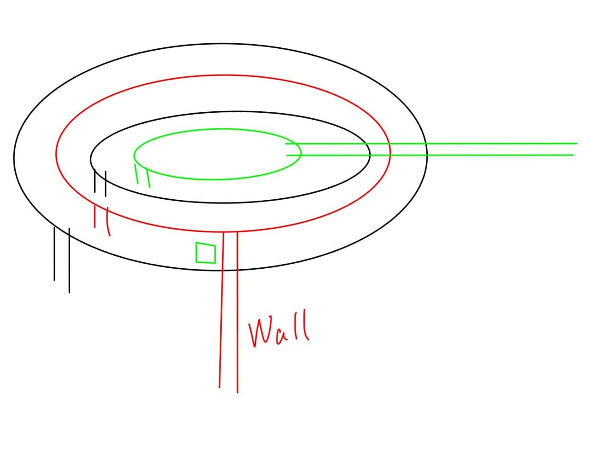

因为神秘原因，我国一座城市被瞬间移动到几百万年前。几百万年前，城市所在的位置是海洋，城市瞬间毁灭。根据研究，与“阴阳调和”有关。之前被移动的城市是“阴”，还将有一座城市被移动，称“阳”。（现实对应：去年看的漫画，`波洞`里的`侏罗纪`。）预测出了一些可能被移动的城市，因为城市太多、具体位置不明，未疏散群众、未向群众公开。我在其中一座城市的研究所兼应急管理办奉命留守。

被移动的正是我所在的城市。预想中的大水并没有到来，城市被半球形的神秘力量保护。一位称为“校长”、身材十分圆润的我的导师的朋友告诉我，这也是“阴阳调和”的力量，保护我们的能量来自先前覆灭的城市。（醒来后想想，此人的形象一直是二次元形象，在现实中没有对应。跟网红王思聪、早忘了的一些校长、傻逼的中学副校长、没见过的大学副校长、德高望重的大学校长等人没有任何关系。）我和校长出来走走。上方能透出阳光，说明水不算深。街上很多人放弃了底线，在打砸抢烧，我们避开。

东北方向（我居然记得方向）是城市的中心，我们发现出现了处凹陷，凹陷被清澈得可怕的海水填满，里面有奇形怪状的史前鱼类游动。凹陷内的建筑物损毁得很严重，并爬满了海洋生物。短短几分钟不应该出现这种情况，我决定下去取一些样本上来研究。取到样本后有一群体型比我大得多的史前鲨鱼宝宝来追我，我居然游得比鱼快，逃掉了。我上岸后，衣服很快就干了。空气干燥得可怕。我突然意识到了，想要生存地足够长以等待可能的救援，还需要注意生态环境。我准备联系我所在的研究所的负责人，却发现有关部门早已向整座城市的人发布了通知（短信、广播等形式）。我才发现城市内竟然修复了网络服务。查看通知，早已发布了临时律令包括了节约用水、保护绿植（是个绿化程度很低的城市）等等的相关条例，还包括禽类感染了未知病毒远离禽类、宵禁等。我一时间不知道为什么宵禁。我也有编辑权限，就加上了销毁烟草、吸烟入刑等。

南方有一座大桥。曾经，大桥是离开这座城市的方式之一。但现在，桥被拦腰截断。校长带着样本回研究所了。我登上大桥，站在边缘，看到不远处，有一座破败的城市。那是之前被移动的城市。这时，看到旁边有一个可疑的人。过去一看，他刚刚捕捉了一只鸽子，准备拿回家吃。鸽子显然不正常，半个头干瘪发黑，嘴里长出尖牙。我告诉他鸽子显然感染了，他摆烂，表示反正城市要灭亡了我吃一只感染的鸽子也没什么。我抢过鸽子扔下桥，并取下了鸽子的脚环作为证据。我准备报警，他拦住我，我们扭打在一起。围观的人渐渐多了起来，但他们和那个摆烂的认识，准备一起杀了我。我一看正是之前打砸抢烧的那群人。我逃了。

我逃到了城市里最大的避难所。可是来到避难所却发现，人们聚集在室外，并搭建了一个大舞台，在开“末日狂欢Party”。（新冠Party既视感。）此时已经是傍晚，我找到避难所负责人，要求严格执行避难所纪律，却遭到嘲笑。我接到研究所的通知，人感染了那种未知病毒后会变成丧尸，丧尸在白天十分迟钝、晚上十分兴奋、对声音、移动的物体、活人的气味都很敏感，人被丧尸咬后几秒钟内便会变成丧尸。哦豁，完蛋。（现实对应：刚刚通关的[Night of the dead](https://store.steampowered.com/app/1377380/Night_of_the_Dead/)，丧尸末日生存游戏。）

舞台构造图。竖着的两条线是梯子或楼梯，除了标有 `Wall` 的是比舞台二层矮一点的墙。

我向远处看去，黑压压一片丧尸向着避难所冲来。我声嘶力竭地大喊，提醒人们快进避难所、或逃往高处，声音却被音乐掩盖。我爬到舞台一层，关闭音乐电源，人们才意识到尸潮来了。人们争先恐后的奔向链接舞台上下层间的梯子或楼梯。我帮助人们爬上舞台一层。最后一个帮助的是一个潜意识中是我曾经的邻居的胖女人，大概200kg。我抓住她使劲往上拉，可是丧尸已经来了。她被丧尸咬了，我松手了。她却抓住我的手不放，并两脚蹬墙试图向上爬。两脚蹬墙是多人协作翻越墙壁等情况最忌讳的，因为这样会使“平行力”大幅度增加，往往下面的人上不去，还把上面的人拉下来。没办法，我用钥匙猛扎她手臂，她吃痛松手，掉入了丧尸群中。

舞台二层有3米高，但我想我难以从拥堵不堪的楼梯上去了。我来到墙（地图中两条红色的长竖线，标有 `Wall` ）边，踩着杂物（地图中绿色的小方块）爬上墙，又爬上舞台二层。舞台三、四、五层只有一米多高，很容易爬上来，那些人却在争抢楼梯甚至为此打起来，看不懂他们。来到了舞台的最顶层，此时只剩下了我一个人。

丧尸并没有那种一蹦十米高、力大无穷的能力，甚至因为缺乏智力，连一米多高的舞台却爬不上来。但是他们因为拥挤和愚笨，很容易发生踩踏事故，被踩倒的丧尸越来越多，摞得和舞台一样高，就上来了。更多的是，被丧尸咬到的人爬上来了，然后变成丧尸、袭击他人，直至此层沦陷。

丧尸上到了最顶层，我拿起长棍与他们搏斗。我也被咬了，等了许久却没有发生任何事。我居然有天然的抗体，我一定是天选之子、救世主、末日小说主角。虽然不会感染，但被咬太多还是会失血过多的。我发现了支撑舞台的钢丝，链接了舞台顶层和不远处的大楼。我爬了上去（确实是在钢丝上爬），向前蠕动。丧尸跟过来了，却因为不会爬掉下去摔死。偶尔有一两只平衡力好的，也被我用棍子打了下去。我蠕动到中间，发现对面大楼处也出现了丧尸，但他们也都掉下去摔死了。城市中的绝大多数丧尸都被我吸引而来，然后就这样摔死了。（真是丧尸片都未曾设想的道路。）

许久，终于白天了。我发现了昏迷的校长，他是在之前送样本时摔倒昏迷的。因为昏迷，他没有发出声音、没有动作，气味也被样本掩盖，因此得以存活。

走向城市中心，发现幸存者还是有十几个的。城市中心出现了与环境格格不入的一排椅子，和两位身着护士装的漂亮姐姐。潜意识告诉我，她们是...NPC...她们告诉众人，可以来当15min的某种“体验”的志愿者，之后可获得纪念品，并拒绝回答无关问题。校长被她们的美色吸引，参与了体验，消失了几分钟后便再一次出现。询问校长，遭受了什么待遇。校长说，需要全程闭着眼睛，否则会有严重的后果。一开始还像是 `5oOF6Laj5oyJ5pGp` ，可是后来，似乎对方在 `55So5aW555qE5YaF6ISP57uZ5LuW5omT6aOe5py6` ，便吓得大叫停止体验，就出来了。看校长的状态，应该并没有受到实质性伤害，重要原因可能是遵守了“闭着眼睛”的规则。我在思考，这是某个“神”给予的挑战还是陷阱。如果是前者的话，奖励应该不错，心理承受能力还可以的我挑战一下也不是不行，大不了也中途大叫停止体验。

我来到两位护士装姐姐面前。她们一位白毛、白色护士装，一位粉毛、粉色护士装。我感觉身穿粉色护士装的姐姐有点眼熟，便向她详细咨询。（醒来一想，什么眼熟，这容貌，这耳朵，这音色，这语气，分明就是[爱莉希雅](https://zh.moegirl.org.cn/index.php?title=%E7%88%B1%E8%8E%89%E5%B8%8C%E9%9B%85)。后文简称爱莉。）

“这个会有生命危险吗？”“不会。”“会有致残危险吗？”“不会。”“中途睁开眼睛会怎么样？”“会很遗憾，挑战失败。”爱莉一脸笑意地看着我。`挑战`，为什么她用的是这个词。我看着她的脸，产生了一种莫名是信任感。“你，建议我参加这次体验吗？”“当然建议了~”（现实对应：[漫画八十一道超纲题](https://www.kuaikanmanhua.com/web/topic/4419/)的[第103话](https://www.kuaikanmanhua.com/web/comic/388148/)末尾处）

我参加了体验，^是挑战。爱莉让我半躺在凭空出现的躺椅上，头枕在黑色的很舒服的枕头上，然后用枕头旁边多出来的竖着的黑布挡住我的眼睛，“这样就不怕睁开眼睛了哦~”我闭上眼睛，等待这疼痛/瘙痒/冰冷/火热，或是什么其它的申必的感觉的袭击。

然后，爱莉吻了上来。我：?????...居然这么好的吗？我感觉我的脸已经通红了。吻一下似乎还不够她又连续地吻了我的右脸、左脸、额头。第一阶段有两分钟，她难道要吻两分钟吗。感觉...超棒的啊，真的快要忍不住睁开眼睛了。可是后来，她明显敷衍了起来，改用手指掐的。emmmmm有点疼。

两分钟结束，休息20秒，爱莉告诉我。她又问我感觉怎么样，我说呜呜呜后面的吻好疼。爱莉露出招牌式的表情，笑而不语。

醒了。

（梦境的结尾是我的大脑在可怜七夕节没有对象的我吗？那为什么不让我做完了呜呜呜。）

（这周四更新，爱莉实装，120攻词缀毕业装做嫁衣，ss起步溢出60碎片封顶。）

（2021年11月更新，爱莉已SS2+毕业装。）

（2022年1月更新，爱莉已SSS+毕业装。）
