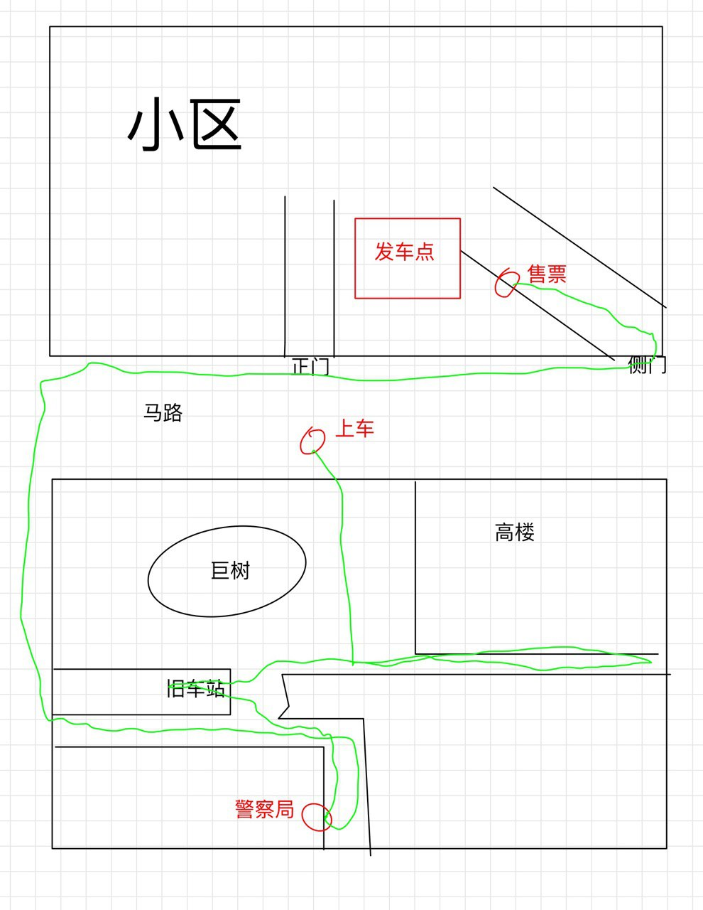

我是高中生，oier，要去青岛比赛，好像是省级的。

先买车票。售票站在我小区西南门进门左手边，售票员是个胖大妈，让我买票后去警察局登记。

我找警察局，在一个小胡同里。

是个瘦男警察。

需要拿买票时同时给的称作“伪票”的白色纸制品登记。醒来后想想“伪票”应该是发票。

我先拿出了彩色的塑料票。警察让我拿伪票，我拿出来，警察看都懒得看，直接让我走。

我看了看表，还有7分钟发车。

我到处找点。

走到一个平房，好象是学校，有一个老师带着一队学生。

仔细一看不是学校，是旧车站。但是不在这里发车。

我想起来在售票处发车，赶快往回跑。抄了近路。

跑到的时候小区门口马路上的时候，来了一辆面包车，在我面前停下开门。竞赛的老师同学都在上面。

跟我说包车了，坐上来走。

The End.
