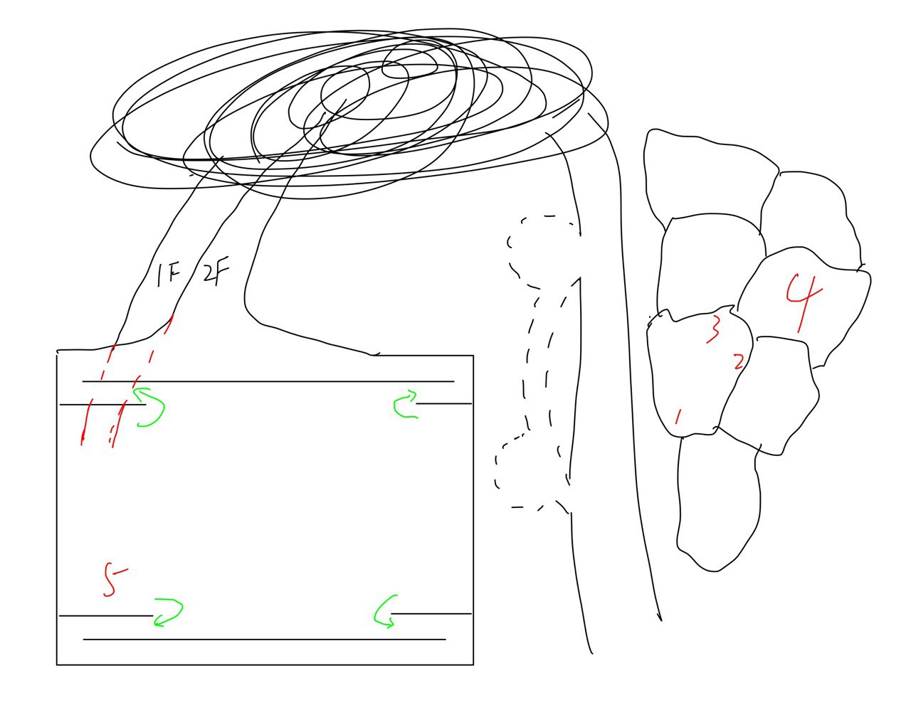

图中中部虚线的山洞可能出自[仁王](https://store.steampowered.com/app/485510/_/)主线关卡**黑暗深处**.

图中左上错综复杂的小路出自[仁王2](https://store.steampowered.com/app/1325200/Nioh_2__The_Complete_Edition/)关卡**寻求妙药**.

其它事物大多出自[崩坏3](https://www.bh3.com/).

我是逐火之蛾员工.

公司团建活动, 我们来到一个地方泡温泉. 温泉是类似梯田的结构, 如图中右部.

我和爱莉、伊甸在同一个池中, 我在图中1的位置, 伊甸在2, 爱莉在3.

苏、凯文、千劫在4处. 因为体质的原因, 千劫会把泉水升温, 凯文会给泉水降温, 苏在平衡他们俩.

这时有大量崩坏兽入侵. 千劫成为了律者, 开始无差别攻击.

我作为没有战斗力的文职人员, 先躲在山洞中, 然后向图中的小路跑去.

路上遇到了从天而降的恢复了一点理智的千劫. 他说饶我一命, 因为我曾声称律者也应该享有人权. 说下一次遇到我就要无差别攻击了.

还有崩坏兽在肆虐, 我到处跑. 跑到图中左下角的方形区域, 是一个斗兽场. 绿色箭头处是楼梯.

爱莉和千劫在斗兽场里, 爱莉强行拉着千劫跳舞, 并让我快跑.

我忘了我跑到哪了, 我好像变得特别厉害了, 想回去制服千劫, 发现他已经恢复意识了.
