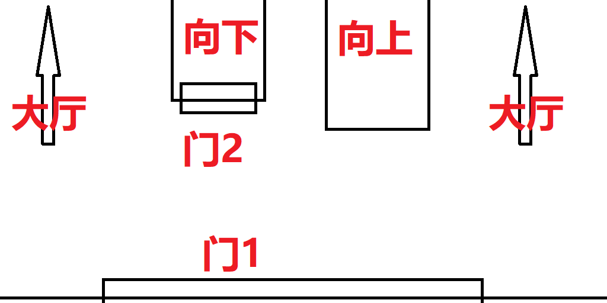

人类有超能力的科幻世界观.

我家里是黑帮老大. 我大概是初中女生. 我有一个哥哥, 在我很小的时候他就不学好, 天天跟一群屁都不是的流氓渣滓混在一块. 有时候会故意来我房间吸烟, 我只能把爸妈叫来赶他走. 后来他 `5by65aW4` 我未遂, 就离家出走了. 走的时候说会回来报仇的.

我要出国留学, 去办护照. 外面再下雨, 我让我爸开车送我去. 我爸有饭局, 不送. 我偏要我爸送, 我爸就赌气地骑自行车送我.

办完出来, 管家已经把车送来了.

开车准备回家, 想要在一个路口调头. 结果不小心撞了周围的设施, 一群条子围了过来. 我们下车了.

一看是一个小区门口, 摆了一些拒马之类的, 一边是一大群居民, 另一边是条子. 小区因疫情封控, 又以疫情为由不提供物资, 居民饿得想要冲出小区.

居民们见我们吸引了条子的视线, 趁机向外冲. 条子开始向人群扫射.

我爸有刀枪不入的超能力, 不用担心, 但是我没有觉醒超能力, 疑似没有. 只能混在人群里快逃.

眼看着条子的机枪就要扫到我这里了, 我只能从大腿侧面拔出手枪, 将条子爆头.

在这里是禁枪的, 我的枪被旁边的人看到了. 对方一脸"我要举报你的表情", 我就抬手把她也打死了.

我往家跑, 路上有沼泽, 站立状态会陷下去, 匍匐前进又太慢. 我想起了群友以前发过的奇妙步法插件, 下载安装, 就自动学会了两种在沼泽中快速前进的两种方式.

我需要赶紧回家. 我家可以帮我摆平刚刚杀人的事.

终于到了家门口.

上图即为我家构造. 门1是单向透明的防弹玻璃(或其它什么新材料)门. 进门后正前方是扶梯, 左边向下, 是卧房/书房/机房/仓库等重要房间, 有防弹门; 右边向上, 是健身娱乐相关房间. 从两边绕过扶梯即为大厅, 再向后走是园子.

进了门1, 却发现门2虚掩着, 警铃大作. 我叫了几声, 没有回应.

我有点担心是我哥哥回来了.

听到上边有声响, 我向右边的扶梯转角处连开几枪. 什么都没有.

我有点害怕. 我从门1 向外观察, 没看到有什么人, 就逃了出去.

我也害怕在关系运作之前被条子抓走, 万一对方滥用私刑, 或者我因经验不足说了什么不该说的话, 导致摆脱不掉, 就糟了.

社区很大, 我躲在一个树林里. 在下雪, 树林里的积雪已经超过膝盖. 我感到又冷又饿.

附近就有超市, 但我不敢进去. 看到有人提着两大包零食从超市里出来. 发现她是独居, 门也没锁好.

我闯进她家, 用枪指着她, 让她给我吃的, 让我在她家住一段时间, 不准报警, 我会付钱. 她笑了笑, 不慌不忙地给我做了一顿丰盛的晚餐.

真的好好吃.

晚上, 我是穿着衣服拿着枪睡的. 她睡在我旁边.

第二天, 我被敲门声吵醒. 她已经醒了. 我示意她去开门, 别耍花招. 我躲在床下, 她将来的两个便衣打发走了. 我只能扫描出这两个人是条子, 却不知道, 这两人实际上是我家的人.

实际上, 条子方面压根不知道我和那场动乱有关, 而我爸也轻松脱身. 我回家时, 只是碰巧我妈误触了警报, 而因为声音太大, 没有人听到我的喊声. 不过幸好, 当时的我还不知道这些, 并因此在她家住了几个月.

没几天, 我就发现, 她并不怕我. 她的超能力很强大, 我就算开着高达也打不过她. 她听我话只是觉得我好玩. 之后我就顺从她了, 她想对我干嘛就干嘛. 我也没想过逃跑, 没地方可去.

几个月后, 我终于联系上了我家里. 我想回家, 已经成为我老婆的她和我一块回去. 我爸见了她被吓了一跳, 又敬又怕的样子, 让我愣了一会.

之后她就在我家住下了.

后来, 我哥哥回来复仇了. 听说他觉醒了很厉害的超能力. 他的超能力可以对自己生效, 获得类似超人的基础战斗力增幅; 他 ($s$) 的超能力也可以对他人 $x$ 进行增幅和控制:

1. 首先, $s$ 需要设立一个敌对目标 $\lambda.$ 该目标不可改变, 否则所有已生效的对非 $s$ 目标的增幅和控制失效.
2. 若 $x<s,$ 且认为 $\lambda<s,$ 且认为 $s$ 是邪恶的 $,\lambda$ 是正义的, 此时, $s$ 可以完全控制 $x.<$ 意为"弱于".
3. 当 $x$ 被控制时, 若未觉醒超能力, 且有待觉醒超能力, 可立即觉醒. 由 $s$ 决定是否觉醒, 强度和正常觉醒一样取决于 $x$ 的天赋.
4. 当 $x$ 被控制时, 若未觉醒超能力, 且无待觉醒超能力, 可获得超能力. 由 $s$ 决定是否获得, 种类随机, 强度随机且不超过 $\min(\lambda,s).$
5. 当 $x$ 被控制时, 若其具有超能力或以上述 3, 4 方式获得超能力, 且强度 $<\min(\lambda,s)$ 时, 可提升至 $\min(\lambda,s),$ 由 $s$ 决定是否提升.

他通过这种方式培养了一支超能力军团, (现实联系: [玛奇玛](https://zh.m.wikipedia.org/zh-cn/%E9%8F%88%E9%8B%B8%E4%BA%BA),) 来我家复仇.

然后他们被我老婆秒杀了.
