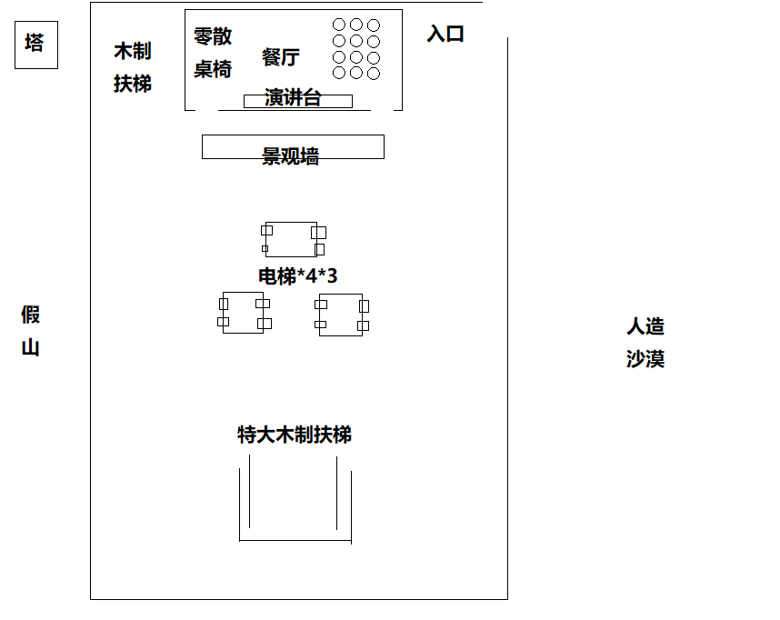
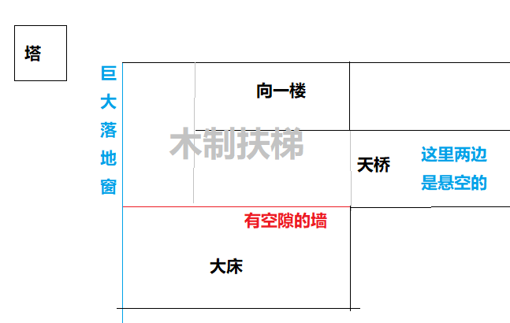

米忽悠有钱了, 盖了座原神主题公园.

我也进去玩. 里面是古风, 所谓璃月风.

场馆一楼地图如图所示.

我从入口进入后, 从最近的门进入餐厅. 餐厅的演讲台上有一位美少女 coser, cos 的是一个我不认识的白毛, 可能是原神新角色. 但我认出了她是米哈游的大股东.

我从餐厅的另一个门出来. coser 向我说再见, 我也挥挥手.

场馆二楼木制扶梯处放大地图如图所示.

我从木制扶梯上楼. 从巨大的落地窗可以看到外面的塔. 塔由直上直下的梯子上下. 塔上看到了我的一位高中学弟, 在和女朋友吃饭.

木制扶梯上到四分之三处, 从天桥上冲过来大量的人. 一位好心人拉着我钻到旁边的大床上躲避人流, 我一看是 PDD.

人流一时半会不会减少. 我突然意识到这是梦.

人流开始主动避让我. 我看着汹涌的人流不敢让他们全部消失, 防止梦醒.

我想找个没人的地方涩涩. 得找机会(如进入新场景)刷新地图.

我也不敢贸然改变建筑结构, 整栋楼只有一楼餐厅较为封闭, 算是"进入新场景". 还好不算远.

中央有电梯. 但是过去发现全都坏了.

尝试维修无果, 绕路"特大木制扶梯", 终于到了餐厅, 我令餐厅里空无一人.

玩了一会之后, 我想尝试一下能不能变成地球上没有的东西, 比如说扶她.

当场触觉混乱梦境崩塌. 还是太勉强了, 醒了.
